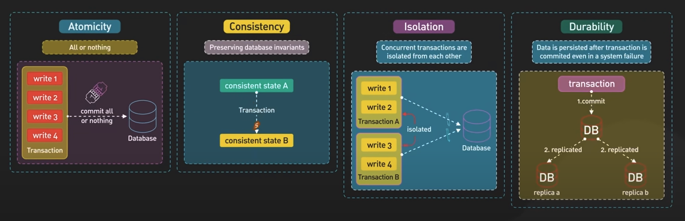
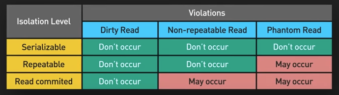
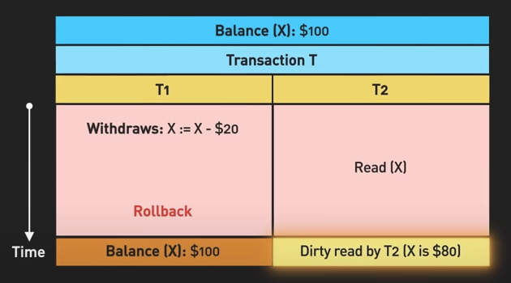
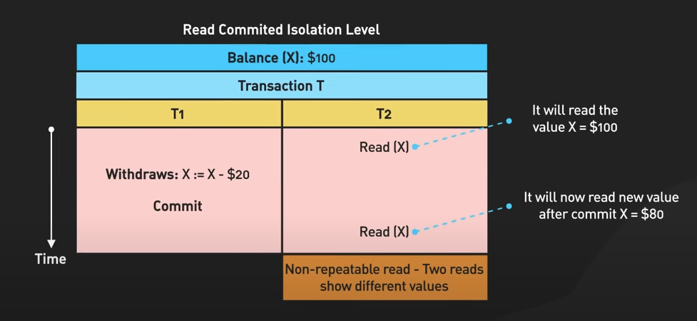
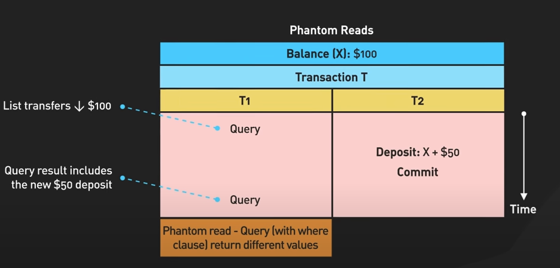

# ACID properties
The properties of a database to ensure reliable transactions, consistency & data integrity.

## 1. Atomicity
When a transaction involving a group of operations is being run on a database and if one of them fails, all the others are reverted as if the transaction never happened - ALL or NOTHING.
This ensures that a transaction is treated as a single, indivisible unit of work preventing partial data update.

## 2. Consistency
We have a set of defined rules to be followed the data.
A transaction should make sure the next state is also valid following the set rules.
This ensures consistency in the data.

## 3. Isolation
The operations of a transaction should be isolated from those of others.
When there are multiple concurrent transactions happening,
the intermediate state of each transaction is not visible to others until the transaction is complete.

Transactions being serializable would slow things down. To speed things up, databases often provide a lower isolation level allowing more transactions to run simultaneously.
But this could bring some inconsistencies like -- dirty reads, non-repeatable reads, phantom reads.

 

  
  
  

## 4. Durability
This ensures that once a transaction is committed,
its changes are permanent and will survive any later system failures.
The changes are stored in non-volatile memory and are not lost.
