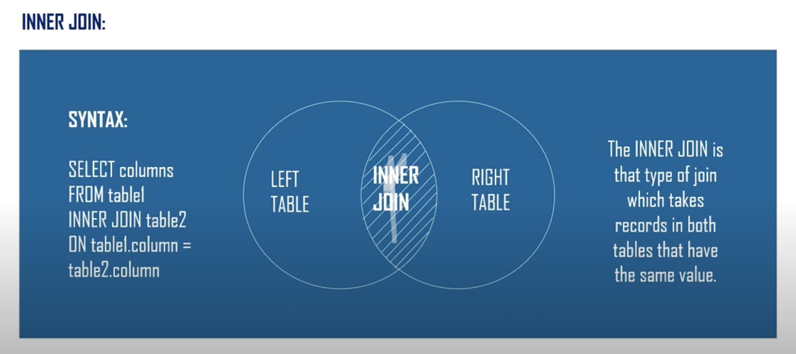
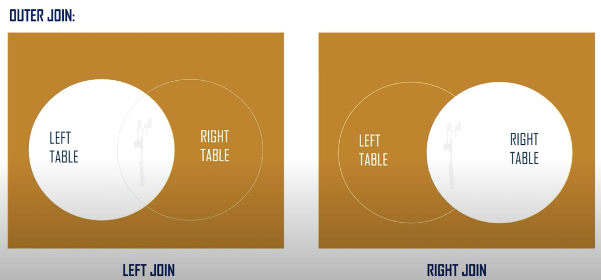
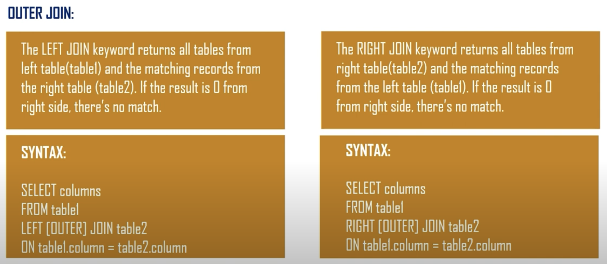
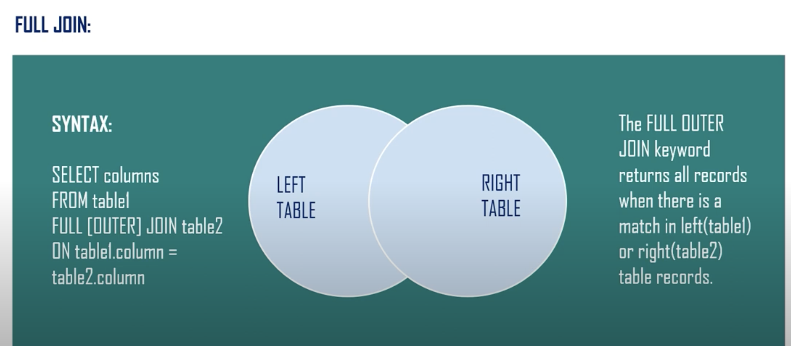
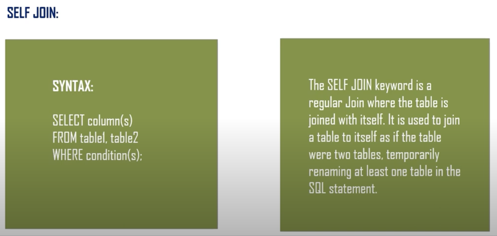

# SQL Join Queries

Types of JOINs:
1. [Inner Join](#1-inner-join) : only returns matching rows
2. [Left Outer Join](#2-left-outer-join) : returns all rows from the left table, even if there’s no match in the right table
3. [Right Outer Join](#3-right-outer-join) : returns all rows from the right table, even if there’s no match in the left table
4. [Full Outer Join](#4-full-outer-join) : returns rows when there is a match in either table, along with non-matching rows from both tables
5. [Cross Join](#5-cross-join) : results in every possible combination of rows between the tables
6. [Self Join](#6-self-join) : joins a table with itself

## 1. Inner Join
Returns records that have matching values in both tables.  



### Syntax
```sql
SELECT columns
FROM table1
INNER JOIN table2
ON table1.column = table2.column;
```
### Example
```sql
SELECT orders.order_id, customers.customer_name
FROM orders
INNER JOIN customers
ON orders.customer_id = customers.customer_id;
```

## 2. Left Outer Join
Returns all records from the left table (table1), and the matched records from the right table (table2). 
If no match is found, NULLs are returned for columns from the right table.




### Syntax
```sql
SELECT columns
FROM table1
LEFT JOIN table2
ON table1.column = table2.column;
```

### Example
```sql
SELECT orders.order_id, customers.customer_name
FROM orders
LEFT JOIN customers
ON orders.customer_id = customers.customer_id;
```

## 3. Right Outer Join
Returns all records from the right table (table2), and the matched records from the left table (table1). 
If no match is found, NULLs are returned for columns from the left table.

### Syntax

```sql
SELECT columns
FROM table1
RIGHT JOIN table2
ON table1.column = table2.column;
```
### Example

```sql
SELECT orders.order_id, customers.customer_name
FROM orders
RIGHT JOIN customers
ON orders.customer_id = customers.customer_id;
```

## 4. Full Outer Join
Returns all records when there is a match in either left (table1) or right (table2) table. 
If no match is found, NULLs are returned for the columns where there is no match.


### Syntax
```sql
SELECT columns
FROM table1
FULL OUTER JOIN table2
ON table1.column = table2.column;
```

### Example
```sql
SELECT orders.order_id, customers.customer_name
FROM orders
FULL OUTER JOIN customers
ON orders.customer_id = customers.customer_id;
```

## 5. Cross Join
Returns the Cartesian product of the two tables, i.e., all possible combinations of rows from the two tables.

### Syntax
```sql
SELECT columns
FROM table1
CROSS JOIN table2;
```

### Example
```sql
SELECT customers.customer_name, products.product_name
FROM customers
CROSS JOIN products;
```
## 6. Self Join
A self join is a regular join but the table is joined with itself.



### Syntax
```sql
SELECT a.column, b.column
FROM table1 a, table1 b
WHERE condition;
```

### Example
```sql
SELECT a.employee_name, b.manager_name
FROM employees a, employees b
WHERE a.manager_id = b.employee_id;
```


