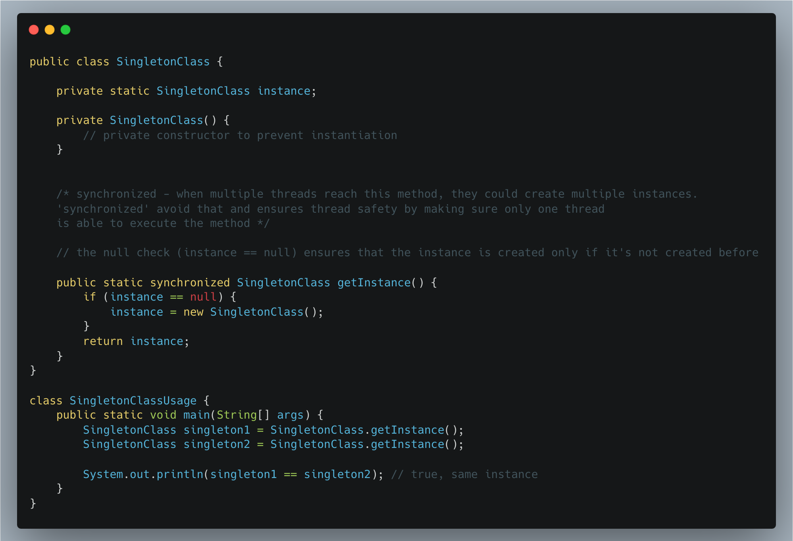
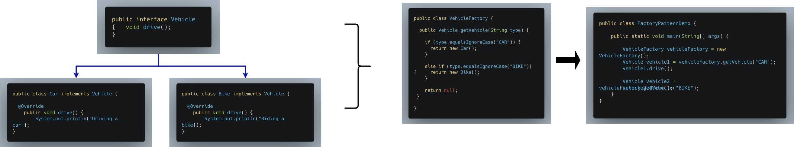
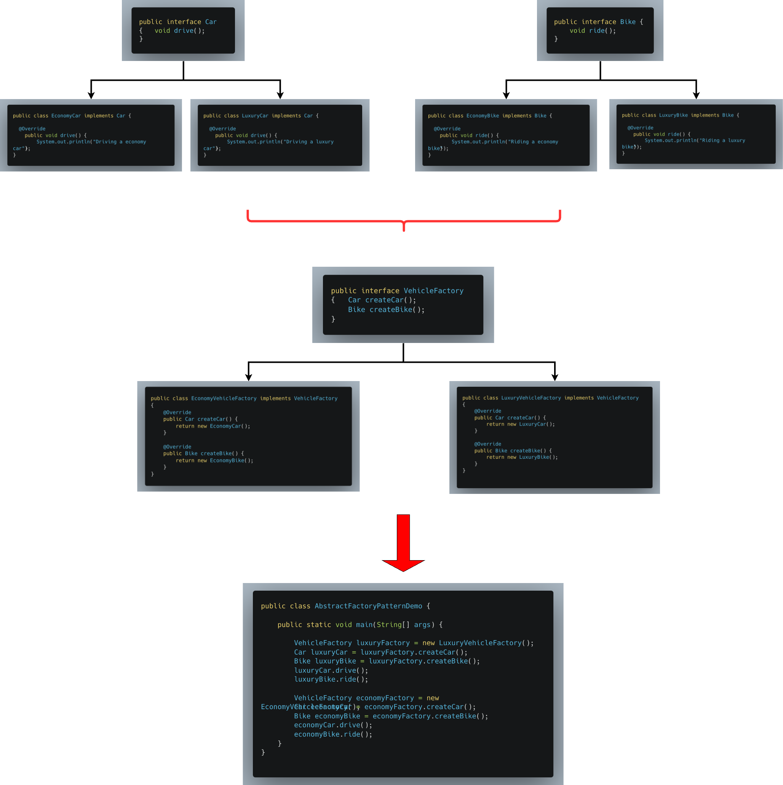
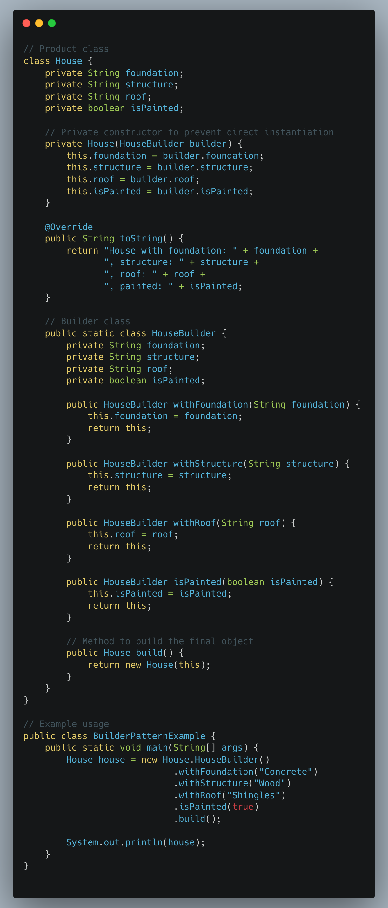

# Creational Design Patterns
[definition, purpose, use cases, design, example, implementation]

**Creational design patterns** are concerned with the process of object creation.
They provide various ways to create objects while hiding the complexities of the instantiation process.


1. [Singleton](#1-singleton-design-pattern) - ensures a class has only one instance and provides a global point of access to it
2. [Factory Method](#2-factory-pattern) - defines an interface for creating objects, but lets subclasses decide which class to instantiate
3. [Abstract Factory](#3-abstract-factory-pattern) - provides an interface for creating families of related or dependent objects without specifying their concrete classes
4. [Builder](#4-builder-pattern) - separates the construction of a complex object from its representation, allowing the same construction process to create different objects
5. [Prototype](#5-prototype-design-pattern) - creates new objects by copying an existing object, known as a prototype

## 1. Singleton Design Pattern

### Definition
A design pattern that ensures a class has only one instance and provides a global point of access to that instance.

### Purpose
This is useful when you want to control access to a shared resource, like a configuration object or a connection pool.

### Use cases

#### 1. Thread Pool Management
- A thread pool manager that manages a pool of threads for executing tasks. 
- A singleton ensures that only one thread pool instance is created, managing resources efficiently.

#### 2. Caching
- A cache manager that stores frequently accessed data. 
- A singleton ensures that there is a single cache instance used across the application, avoiding duplication of cached data.

#### 3. Database Connections
- A database connection manager that handles connections to a database. 
- Using a singleton can help manage a single database connection or a connection pool, reducing overhead and ensuring consistent access.

#### 4. Logging
- A logging class that writes log messages to a file or console. 
- A singleton ensures that all log messages go through the same logging instance, preventing issues like multiple log files or inconsistent logging

### Design

* `Single Instance`: Ensures that only one instance of the class is created.
* `Global Access`: Provides a global point of access to the instance.
* `Lazy Initialization`: The instance is created only when it is needed (optional but common practice).
* `Eager Initialization`: The instance is created at the time of class loading. This is simple but can lead to unnecessary resource usage if the instance is never used.

### Example
Let's implement a simple Java class that behaves like a Singleton class

### Implementation


<br></br>

## 2. Factory Pattern

### Definition
- A design pattern used to create objects without exposing the creation logic to the client. 
- It provides an interface for creating objects, allowing subclasses to alter the type of objects that will be created.


- **Encapsulation of object creation logic:** The factory method handles the instantiation of the objects.
- **Decoupling:** The client only knows about the abstract type (interface/abstract class), not the actual concrete class that is instantiated.
- **Flexibility:** Easily extendable with new product types without changing existing code, adhering to the Open-Closed Principle.

#### Benefits
* **Decouples** object creation from the client.
* **Easily extendable:** If a new vehicle type is introduced, like Bus, only the factory and the new class need modification.

### Purpose
Used in various scenarios where object creation requires flexibility, 
decoupling, or the creation logic can change based on specific conditions 
without the client having to know which subclasses to create.

### Use cases

#### 1. To support multiple payment options in the future
* **Use Case:** If you want to add new classes to your system without modifying existing client code, the Factory Pattern provides a good solution.
* **Example:** If a payment system supports Credit Card and PayPal initially, but later on needs to support Google Pay, the factory can easily be extended without changing the existing logic.
```java
Payment payment = PaymentFactory.getPaymentMethod("GooglePay");
payment.process();
```

#### 2. When You Want to Hide Complex Object Construction Logic
* **Use Case:** The factory pattern can abstract complex object creation logic so that the client code does not have to deal with it.
* **Example:** A system that handles multimedia files (images, videos, audio) where each file type requires different decoding mechanisms.
```java
MediaFile file = MediaFactory.getMediaFile("MP4");
file.play();
```

#### 3. When You Need to Manage the Versioning of Objects
* **Use Case:** When a class evolves over time with new versions, the factory can handle creating the correct version based on the input.
* **Example:** If a document management system needs to handle multiple versions of a file format, a factory can instantiate the correct version of the document handler.
```java
DocumentHandler handler = DocumentHandlerFactory.getHandler("v2");
```

### Design

- `Product` interface: declares the interface of the objects that the factory method creates
- `Concrete Product` classes: these classes implement the product interface
- `Creator (Factory)` class: declares the factory method, which returns an object of type `Product`
- `Concrete Creator`: implements the factory method to create instances of concrete product types.

### Example
Let's say we have different vehicles like Bike, Car, etc. 
We want the client to initiate instances as per required without having to know about the associated concrete classes.

### Implementation


<br></br>
**Purpose:** When you want to create objects of different classes without specifying the exact class based on some conditions

**Use Case:** When a class can’t anticipate the type of objects it needs to create or when subclasses are expected to specify the objects to be created.

**Implementation:** Involves a base class with a factory method that is overridden by subclasses to create specific objects.


<br></br>

## 3. Abstract Factory Pattern

### Definition
A design pattern
that provides an interface
for creating families of related or dependent objects without specifying their concrete classes.

### Purpose
It's useful when you need to create objects from several related classes without knowing their exact types.

### Use cases

### Design
- `Abstract Factory` interface: Declares the creation methods for each product type.
- `Concrete Factory`: Implements the creation methods for the specific product family.
- `Abstract Product` interface: Declares the interface for a type of product.
- `Concrete Product`: Implements the abstract product interface.
- `Client`: Uses the factories to get instances of products but is unaware of the specific classes being created.

### Example
Let's take the same example as above - vehicles like Car, 
Bike but with subcategories of Luxury vehicles & Economic vehicles

### Implementation


<br></br>


## 4. Builder Pattern

### Definition

### Purpose

### Use cases

### Design

### Example

### Implementation


<br></br>

**Purpose:** Separates the construction of a complex object from its representation so that the same construction process can create different representations.

**Use Case:** When an object needs to be created with many possible configurations or when the construction process involves multiple steps.

**Implementation:** Involves a builder class that assembles the parts of an object and a director class that directs the building process.



**Explanation:**
- House: The House class is the complex object that we want to build. It has private fields and a private constructor that only the HouseBuilder can use.
- HouseBuilder: The static HouseBuilder class is responsible for building the House object. It contains methods for setting each attribute of the House. Each method returns this to allow for method chaining. Its made static to be able to be used with House without creating an instance of house first.
- build(): The build() method creates an instance of House using the HouseBuilder.
- Main Method: The example usage demonstrates how to create a House object using the builder pattern.

<br></br>

## 5. Prototype Design Pattern

### Definition

### Purpose

### Use cases

### Design

### Example

### Implementation

**Purpose:** Specifies the kinds of objects to create using a prototypical instance and creates new objects by copying this prototype.

**Use Case:** When the cost of creating a new object is more expensive than copying an existing object, or when objects can be cloned rather than created from scratch.

**Implementation:** Involves a prototype interface with a method for cloning itself and concrete classes that implement this method.  