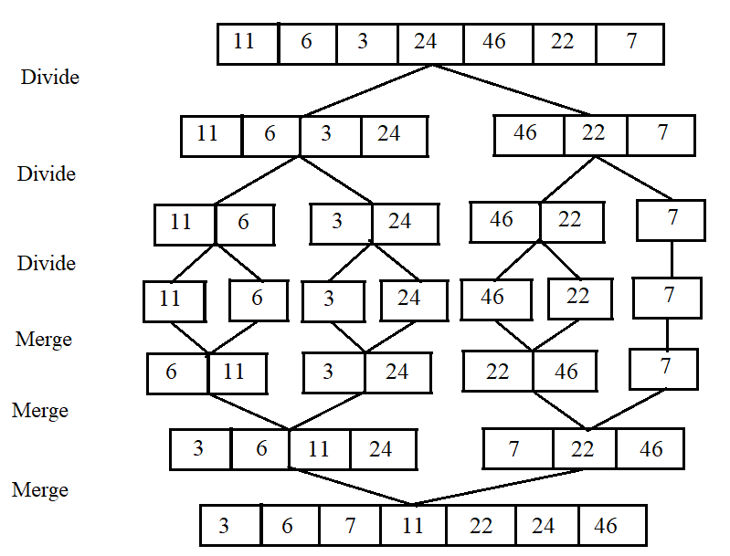
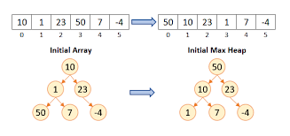
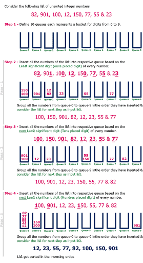

## Sorting Techniques
### Terminology
1. **Stability** : Elements of same value retain their original positions.  
2. **In-place** : Uses constant space for producing the output (modifies the given array only).  
3. **Internal** : All data is placed in the main memory or internal memory. The problem cannot take input beyond its size.

### 1. Selection Sort
Repeatedly select the lowest/highest element from the unsorted part of the list & place it after the sorted part of the list.  
  
**Time Complexity:** O(n^2) in all cases  
**Space Complexity:** O(1)  
[**Code**](../../../../src/main/java/com/dsa/algorithms/service/sorting/SortingTechniques.java#L19)  
❌ Stable (default) (can me made stable)  
✔️ In-place  
✔️ Internal

### 2. Bubble Sort
Repeatedly swap the adjacent elements if they're in the wrong order, bringing the highest element to the end in each iteration.  
  
**Time Complexity:** O(n^2) in worst & avg, O(n) in best cases (already sorted)  
**Space Complexity:** O(1)  
[**Code**](../../../../src/main/java/com/dsa/algorithms/service/sorting/SortingTechniques.java#L36)  
✔️ Stable  
✔️ In-place  
✔️ Internal

### 3. Insertion Sort
Iteratively insert each element of an unsorted list into its correct position in the sorted portion of the list.        
  
**Time Complexity:** O(n^2) in worst & avg, O(n) in best cases (already sorted)  
**Space Complexity:** O(1)  
[**Code**](../../../../src/main/java/com/dsa/algorithms/service/sorting/SortingTechniques.java#L57)  
✔️ Stable  
✔️ In-place  
✔️ Internal

### 4. Merge Sort
Recursively divide the input into smaller sub-arrays and sort those & merge them back by Divide & Conquer approach.  
  
This one of the most optimised & most used sorting algos.  
**Time Complexity:** O(n logn)  
**Space Complexity:** O(n)  
[**Code**](../../../../src/main/java/com/dsa/algorithms/service/sorting/MergeSortAlgorithm.java#L11)    
✔️ Stable  
❌ In-place  
✔️ Internal

### 5. Quick Sort
Recursively pick an element as pivot and partition the array around it by placing the pivot in its correct position in the sorted array by Divide & Conquer aproach.    
   
**Time Complexity:** O(n logn) in best cases, O(n^2) is worst & avg (poor choice of pivot)   
**Space Complexity:** O(1) excluding stack space  
[**Code**](../../../../src/main/java/com/dsa/algorithms/service/sorting/QuickSortAlgorithm.java#L8)  
❌ Stable  
✔️ In-place  
✔️ Internal  

### 6. Heap Sort
An optimization over selection sort where we repetitively select the max element and then here we swap it with the last element and repeat the process for the list before the last element. We use Binary Heap to find the max element: O(logn) instead of generic O(n) method.
* Build a max heap from the given input array.
* Repeat the following steps until the heap contains only one element:
  * Swap the root element of the heap (which is the largest element) with the last element of the heap.
  * Remove the last element of the heap (which is now in the correct position).
  * Heapify the remaining elements of the heap.
* The sorted array is obtained by reversing the order of the elements in the input array.  

  
**Time Complexity:** O(n logn)     
**Space Complexity:** O(1) excluding stack space; O(log n) for auxiliary stack space  
[**Code**](../../../../src/main/java/com/dsa/algorithms/service/sorting/HeapSortAlgorithm.java)
❌ Stable  
✔️ In-place  
✔️ Internal 

### Radix Sort
* The key idea behind Radix Sort is to exploit the concept of place value. 
* It assumes that sorting numbers digit by digit will eventually result in a fully sorted list. 
* Radix Sort can be performed using different variations, such as Least Significant Digit (LSD) Radix Sort or Most Significant Digit (MSD) Radix Sort.  
  
**Time Complexity:** O( d * (n+b) ) : d=number of digits, b=base used    
**Space Complexity:** O( n+b )  
[**Code**](../../../../src/main/java/com/dsa/algorithms/service/sorting/RadixSortAlgorithm.java)
❌ Stable (default, but made unstable by traversing from the units place)  
❌ In-place  
✔️ Internal

