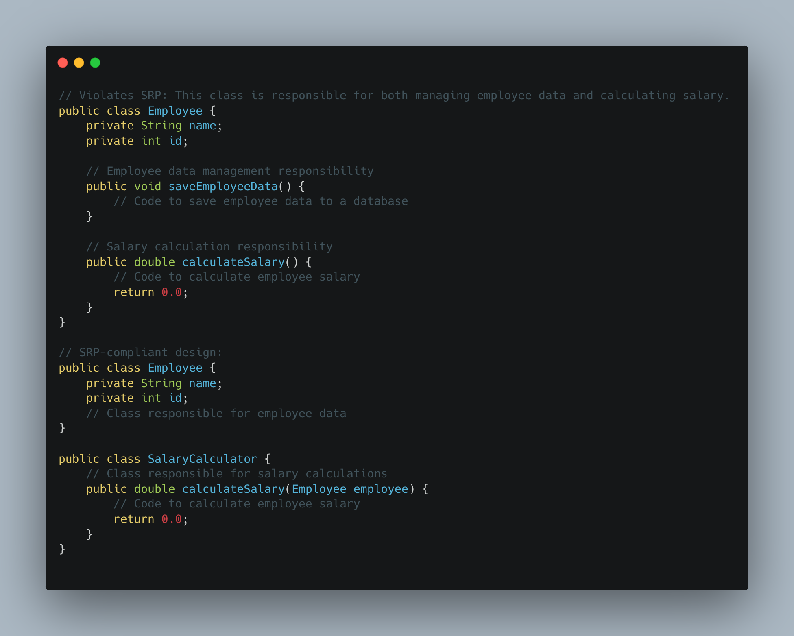
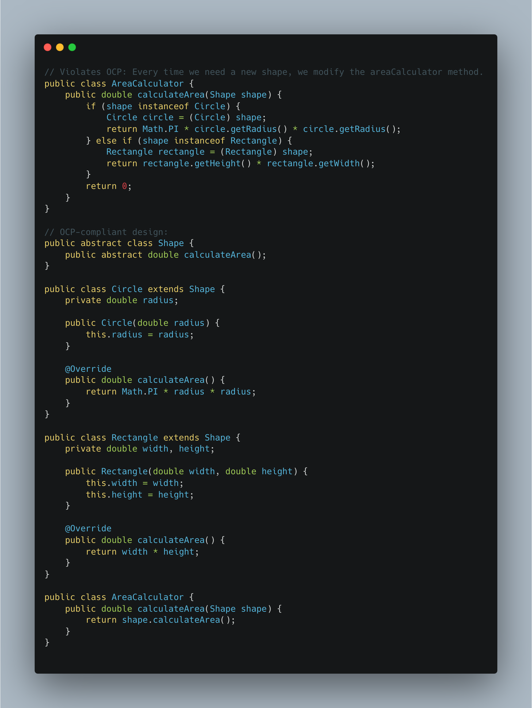
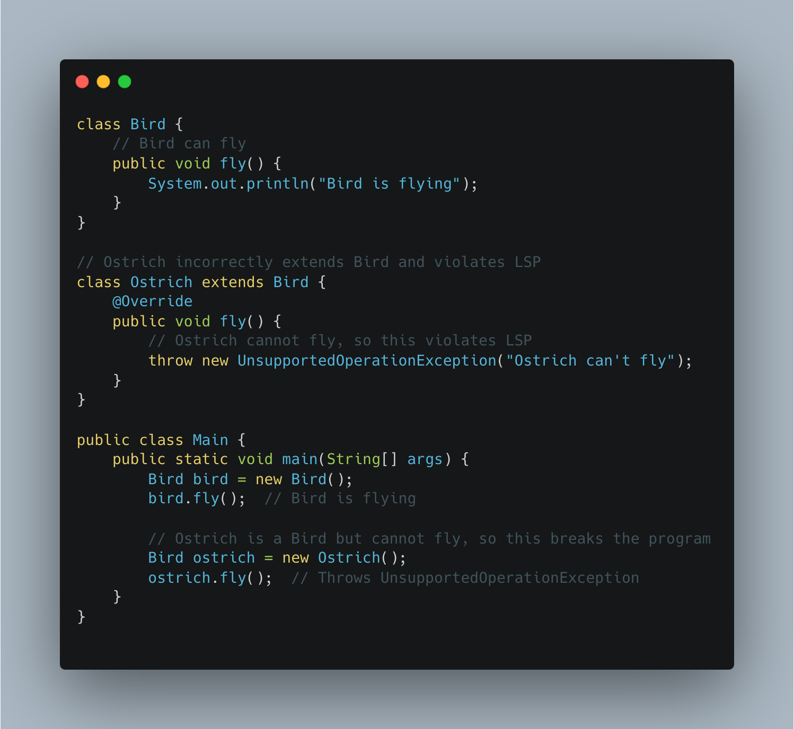
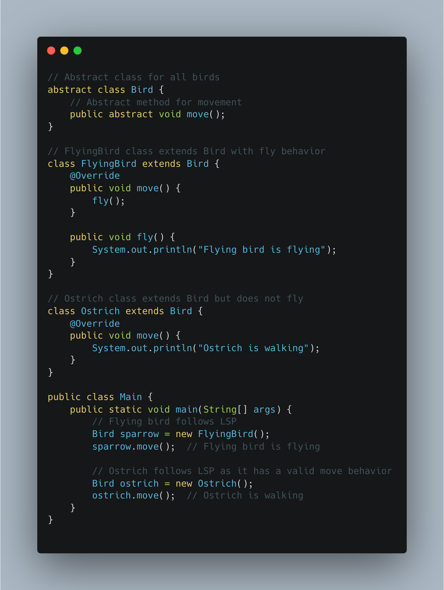
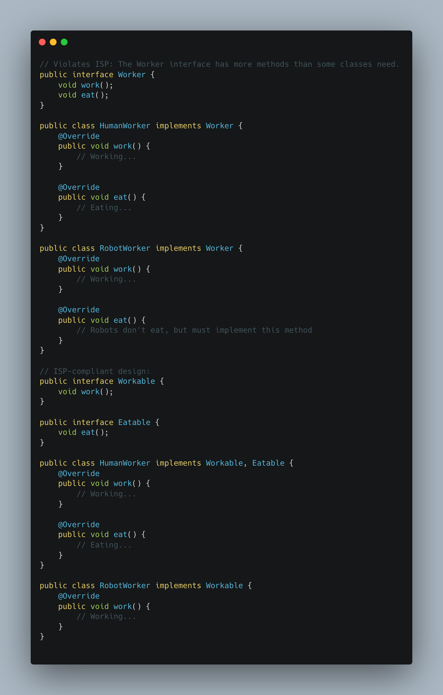
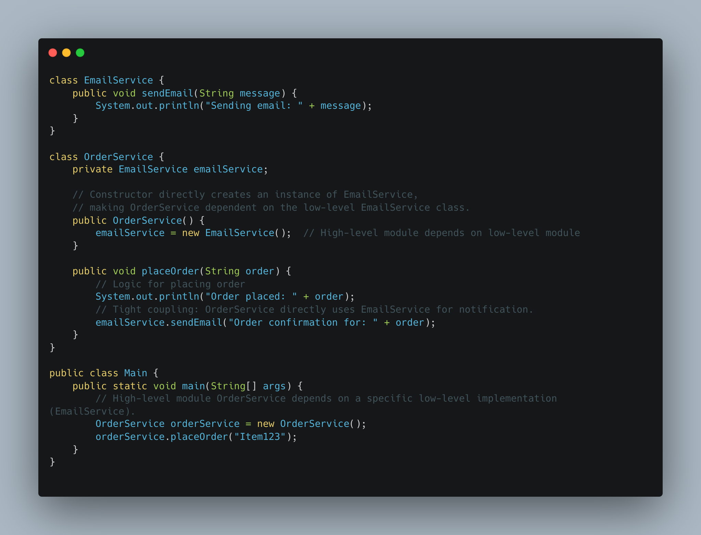
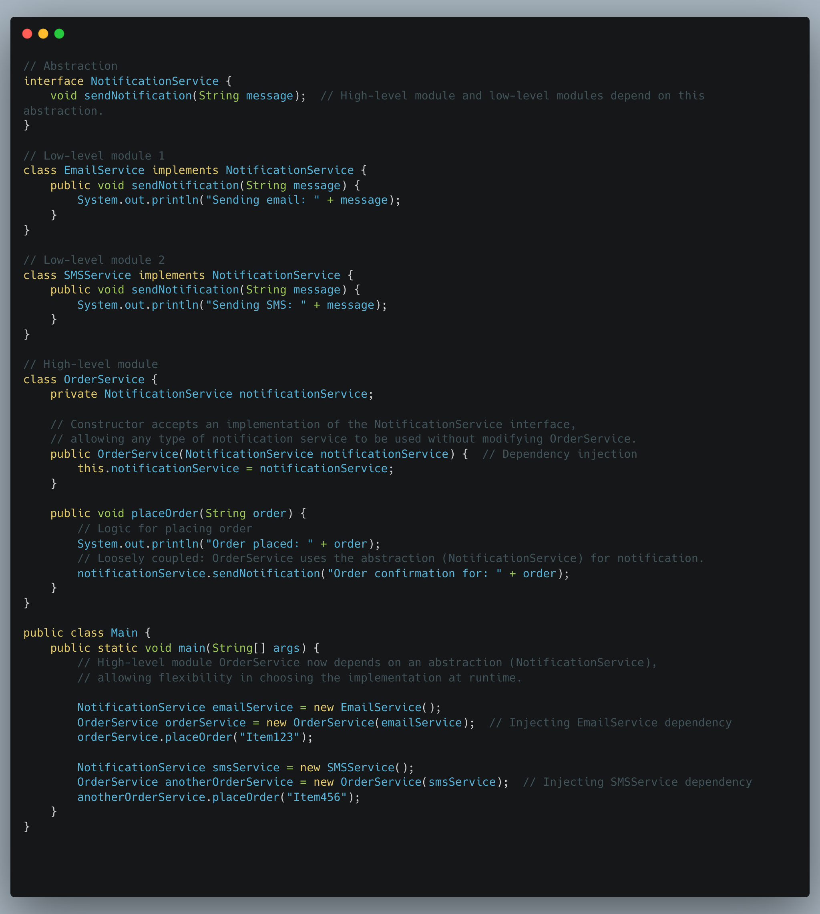

# SOLID Principles
- Single Responsibility Principle
- Open/Closed Principle
- Liskov Substitution Principle
- Interface Segregation Principle
- Dependency Inversion Principle

### 1. Single Responsibility Principle (SRP)
A class should have only one reason to change, meaning it should have only one job or responsibility.  

  
  

### 2. Open/Closed Principle (OCP)
Software entities (classes, modules, functions) should be open for extension but closed for modification. This means that the behavior of a class can be extended without modifying its source code.  

  
  

### 3. Liskov Substitution Principle (LSP)
Objects of a superclass should be replaceable with objects of a subclass without affecting the correctness of the program.  

  
  

  
  

### 4. Interface Segregation Principle (ISP)
Interfaces should be small & specific to the purpose rather than big and generic in purpose.  

  
  

### 5. Dependency Inversion Principle (DIP)
High-level modules should not depend on low-level modules. Both should depend on abstractions. Abstractions should not depend on details. Details (i.e., concrete implementations) should depend on abstractions.  

  
  

