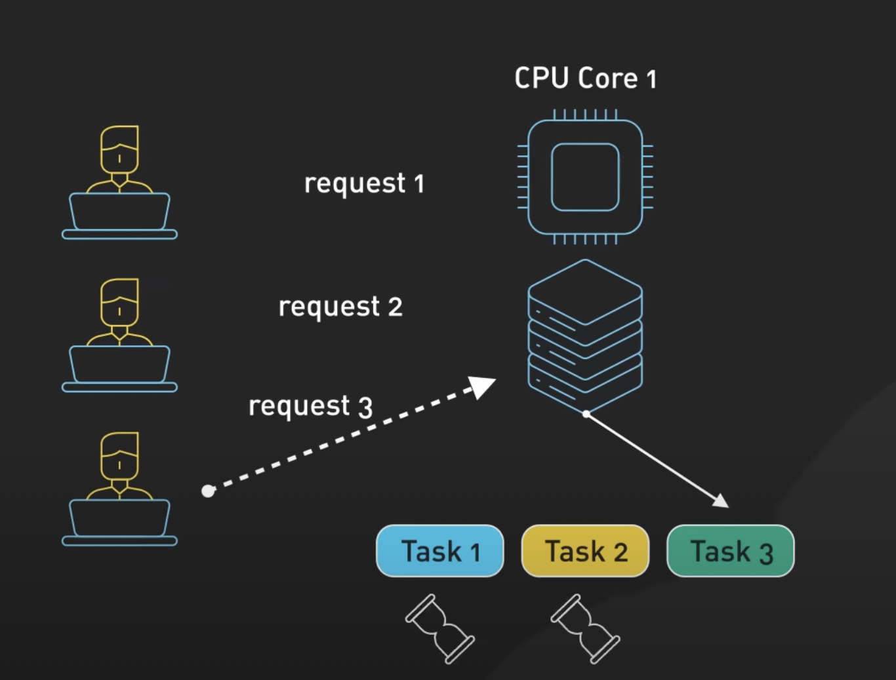
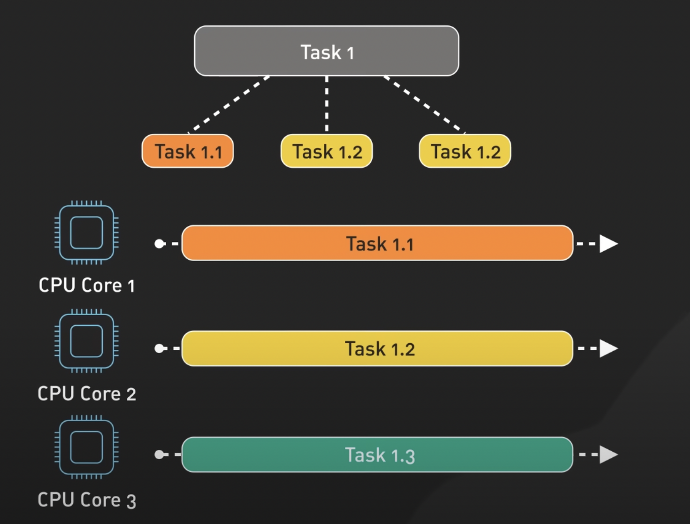
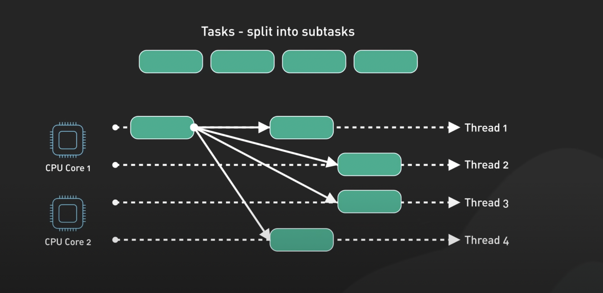

# Concurrency VS Parallelism

**Concurrency** is one CPU alternating between multiple tasks by **_context-switching_**, so there is progress in all of those tasks.

**Parallelism** is multiple CPUs working on multiple tasks; each core handles a different task independently at the same time.

## Concurrency

### Definition 
Concurrency refers to the ability of a system to handle multiple tasks at the same time by allowing them to make progress. This doesn't necessarily mean they are being executed simultaneously; rather, it means that tasks are overlapping in execution.

### Key Characteristics

- Tasks can be interleaved on a single core or run simultaneously on multiple cores.
- It focuses on the structure of the program to allow multiple tasks to make progress.

- Concurrency is often used in systems with shared resources where tasks may need to wait for one another.

### Example
In a web server handling multiple requests, the server can start processing one request while waiting for I/O operations (like database queries) to complete for another request.

## Parallelism

### Definition
Parallelism is a specific form of concurrency that involves executing multiple tasks simultaneously, typically on multiple processors or cores. 
It is concerned with the actual simultaneous execution of tasks.

### Key Characteristics

- Tasks run at the same time, using multiple CPUs or cores.
- It aims to reduce the overall execution time of a program by dividing tasks into smaller subtasks that can be processed concurrently.

### Example
1. A program that processes an image by splitting it into sections and processing each section on a separate core is an example of parallelism.
2. Video rendering benefits from parallelism by processing multiple frames simultaneously across multiple cores.
3. Machine learning can leverage parallelism by distributing the training across multiple CPUs.

## Summary

- While concurrency and parallelism are different, they are closely related. Concurrency can make use of parallelism for efficient execution.
- Through concurrency, a complex task can be split into smaller independent tasks—making it easier to take advantage of the parallelism of those subtasks' execution.

