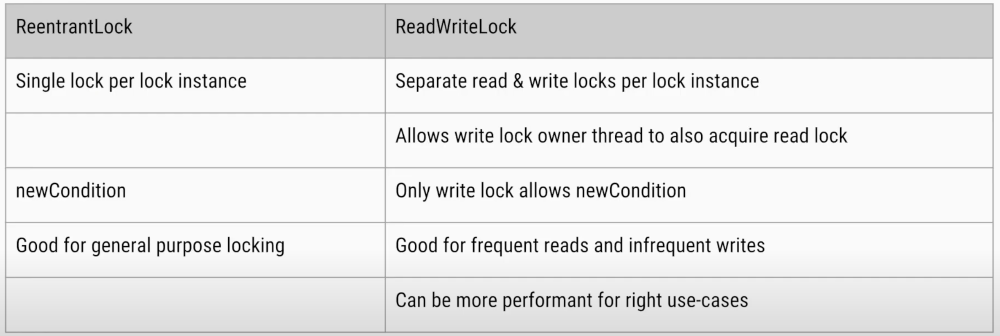

# Designing thread-safe classes
Thread safe classes are the classes whose objects (resources) can be shared by multiple threads and concurrent modifications are possible without any racing race conditions or data inconsistencies.

By following the below principles, you can design classes that behave correctly and safely in multi-threaded environments.
## 1. Immutable Classes
Immutable objects are inherently thread-safe because their state cannot be modified after construction.
You can design your class to be immutable by:
- Make all the fields `final`
- Set all the fields in the constructor
- Avoid setter methods of the fields
- Example :
```java
public final class ImmutableCounter {
    private final int count;

    public ImmutableCounter(int count) {
        this.count = count;
    }

    public int getCount() {
        return count;
    }
}
```

## 2. Use Synchronization
Synchronization ensures that only one thread can execute a block of code at a time.
This prevents race conditions when multiple threads access shared resources.
- Use `synchronized` methods or blocks to protect the critical sections of a class
- Be cautious of deadlocks by avoiding nested locks and acquiring locks in a consistent order.
- Example :
```java
public class SynchronizedCounter {
    private int count = 0;

    public synchronized void increment() {
        count++;
    }

    public synchronized int getCount() {
        return count;
    }
}
```

### Advantages:
- The developer doesn't need to worry about the order&implementation of releasing the locks and implementing the locking since JVM automatically takes care of it.
### Disadvantages:
- When a thread is running the synchronized method/block, it is locked.
  No other thread can access and hence would be put in a queue.
  The other threads can only access once the lock is released by the current thread.
  **This will make the process slow.**
- This way also forces you to lock and unlock the method in a block-structured way.
  E. g., if locks are aquired in the order of 1->2->3->4, they need to be released in 4->3->2->1 to avoid a **DeadLock** situation.


## 3. Use Locking Mechanisms
Java provides `java.util.concurrent.locks` package, which offers more advanced locking mechanisms like `ReentrantLock`, `ReadWriteLock`, etc compared to `synchronized` methods.
These locks offer more flexibility than synchronized methods or blocks.

* **ReentrantLock:** Provides explicit locking and more control over lock acquisition and release.
* **ReadWriteLock:** Allows multiple readers but only one writer, which can improve performance for read-heavy workloads.

**Note:** In ReadWriteLock, it allows EITHER ReadLock for n users at a time OR WriteLock for one user at a time but not both.

### Understanding through an example
Say we have a ticket booking system.
Multiple users (threads) will try to view the chart and book a ticket.
Reentrant Locking system would be causing slowness
because viewing can be allowed to multiple users at a time since it won't cause data inconsistencies.
ReadWrite Locking would work better in this case.  
[**Refer this for a working code example**](../../src/main/java/com/dsa/algorithms/domain/java/locking/LockingMechanisms.java)



### Advantages:
- It allows multiple locks to be acquired and released in any order.
- Locks also provide additional functionalities of
    - `tryLock()`(an attempt to acquire the lock)
    - `lockInterruptibly()`(an attempt to acquire the lock that can be interrupted)
    - `tryLock(long, TimeUnit`) (an attempt to acquire a lock that can timeout)

### Disadvantages:
- The developer needs to take care of all the locks are released at the end while also avoiding the **DeadLock** situation.

## 4. Use Atomic Variables
For simple atomic operations like increments and decrements, use classes from the `java.util.concurrent.atomic` package.
Classes like `AtomicInteger`, `AtomicLong`, etc., provide lock-free thread safety for single variables.
```java
import java.util.concurrent.atomic.AtomicInteger;

public class AtomicCounter {
    private final AtomicInteger count = new AtomicInteger(0);

    public void increment() {
        count.incrementAndGet();
    }

    public int getCount() {
        return count.get();
    }
}
```

## 5. Use Thread-safe Collections
Use thread-safe versions of collections, such as `ConcurrentHashMap`, `CopyOnWriteArrayList`, and `BlockingQueue`, provided in the `java.util.concurrent` package.
These collections handle synchronization internally and are designed for high-concurrency scenarios.
```java
import java.util.concurrent.ConcurrentHashMap;

public class ThreadSafeCache {
    private final ConcurrentHashMap<String, String> cache = new ConcurrentHashMap<>();

    public void put(String key, String value) {
        cache.put(key, value);
    }

    public String get(String key) {
        return cache.get(key);
    }
}
```

## 6. Minimize Lock Scope
Keep the scope of synchronized blocks as small as possible to reduce contention and improve performance. 
Only synchronize the critical section of the code that modifies shared state.

## 7. Avoid Deadlocks
Be mindful of potential deadlocks, where two or more threads are waiting on each other to release locks. 
Strategies to avoid deadlocks include:
- Always acquiring locks in a consistent order.
- Using timed locks (e.g., tryLock() with a timeout).
- Locking on distinct objects instead of shared objects.  

[Refer the code for a working example of a deadlock](../../src/main/java/com/dsa/algorithms/domain/java/DeadlockExample.java)

## 8. Use ThreadLocal Variables
When each thread needs its own copy of a variable, use `ThreadLocal`. 
This ensures that each thread has its own independent instance of the variable, avoiding shared state issues.
```java
public class ThreadLocalExample {
    private static final ThreadLocal<Integer> threadLocalValue = ThreadLocal.withInitial(() -> 0);

    public void setValue(int value) {
        threadLocalValue.set(value);
    }

    public int getValue() {
        return threadLocalValue.get();
    }
}
```

## 9. Use Higher-Level Concurrency Utilities
Java provides higher-level concurrency utilities like `ExecutorService`, `ForkJoinPool`, `CountDownLatch`, `CyclicBarrier`, etc. 
These abstractions help manage concurrency without needing to deal with low-level thread management directly.

## 10. Correctness over Performance
Focus on ensuring correctness first when designing thread-safe classes. 
Once correctness is ensured, you can optimize performance by reducing the scope of synchronization or using more advanced concurrency techniques.
