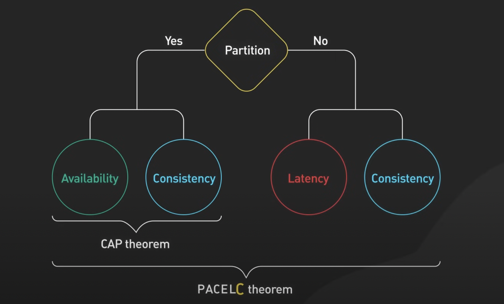

# CAP & PACLEC Theorems

## CAP Theorem

The CAP theorem, also known as Brewer's theorem, states that 

In a distributed data store, we can guarantee at the most of 2 out of the below three properties. 

The CAP theorem is criticized for being narrow. PACLEC theroem is an extension to it, to handle the trade-offs better.

### 1. Consistency (C)

- Every read receives the most recent write or an error. 
- This means all nodes in a distributed system have the same data at the same time, ensuring consistency across the system.

### 2. Availability (A)

- Every request (read or write) receives a response, even if some nodes are down. 
- This means the system remains operational and continues to provide responses to requests, though it may not always be the most recent data.

### 3. Partition Tolerance (P)

- The system continues to operate even if network partitions occur (i.e., communication between nodes is interrupted). 
- This means the system can handle network failures where nodes cannot communicate with each other.

## Use cases

### CA (Consistency & Availability)

- It means the system is consistent and available as long as there are no network partitions. 
- In a real-world distributed system, network partitions are inevitable, so guaranteeing both consistency and availability during a partition is impossible.
- **Example**: Traditional RDBMS like MySQL or PostgreSQL running on a single node.
- Consistency: Any query will always reflect the latest committed data. 
- Availability: As long as the database server is running, it can serve requests.
- **Limitation:** It doesn’t handle partition tolerance, because a single-node system fails when that node crashes.

### AP (Availability & Partition Tolerance)

- These databases prioritize availability and partition tolerance. 
- When a network partition occurs, the system remains available by allowing reads and writes, but it sacrifices consistency. 
- Eventually, data becomes consistent after the partition heals (using an **eventual consistency model**).
- **Example:** Cassandra or DynamoDB.
- Availability: The system is designed to be always available, even if part of the network is unreachable. 
- Partition Tolerance: If the network partitions (i.e., some nodes can't communicate), the database continues to serve requests on all available nodes. 
- **Limitation:** Consistency is not immediate, so during network splits, different nodes may have different versions of the data. It converges to consistency eventually, but for a short period, clients might see outdated data.

### CP (Consistency & Partition Tolerance)

- These systems prioritize consistency and partition tolerance. 
- When a partition occurs, they maintain consistency by delaying responses (or blocking writes) to ensure the data remains consistent across nodes. 
- The system may temporarily become unavailable until the partition heals.
- **Example:** HBase or Google Spanner.
- Consistency: The system ensures that once data is written, all nodes reflect the latest data, even in the presence of network partitions. 
- Partition Tolerance: It is designed to tolerate network partitions and will still operate during a partition. However, the system may delay serving requests until it can guarantee consistency. 
- **Limitation:** Availability can suffer during network partitions because the system may reject requests to preserve consistency.

## PACLEC Theorem

- The PACELC Theorem is an extension of the CAP Theorem that provides a more complete understanding of the trade-offs in distributed systems. 
- While the CAP Theorem only considers trade-offs during a network partition (i.e., when the system faces a partition, it must choose between Consistency and Availability), 
- PACELC adds a new dimension by considering the trade-offs even when there is no partition.

The PACELC theorem suggests that not only must a system choose between consistency and availability during a partition (CAP), but also, in the absence of a partition (else), it must trade-off between latency and consistency.

### Breakdown of PACELC

P: Partition  
A: Availability  
C: Consistency  
E: Else  
L: Latency  
C: Consistency  

PACELC extends the CAP theorem by considering what happens when there is no partition.

- During a partition (P), the system still faces the C vs A trade-off (just like CAP).

- Else (E) (when there is no partition), the system faces a different trade-off between:
  - L (Latency): Favoring low-latency, faster response times.
  - C (Consistency): Favoring strong consistency across all nodes.
  

- Essentially:
  - P (Partition): Choose between A (Availability) and C (Consistency). 
  - E (Else, No Partition): Choose between L (Latency) and C (Consistency).

### How PACELC is Better Than CAP

- **More Comprehensive**: PACELC considers both partitioned and non-partitioned scenarios, giving a more holistic view of the trade-offs distributed systems must make.
- **Latency Trade-off**: CAP ignores the latency-consistency trade-off, which is crucial for system performance in real-world applications, especially when no network failures are happening.
- **Reflects Real-world Behavior**: In practice, distributed systems operate most of the time without partitions, and the latency-consistency trade-off is very relevant during normal operations, which CAP doesn’t account for.