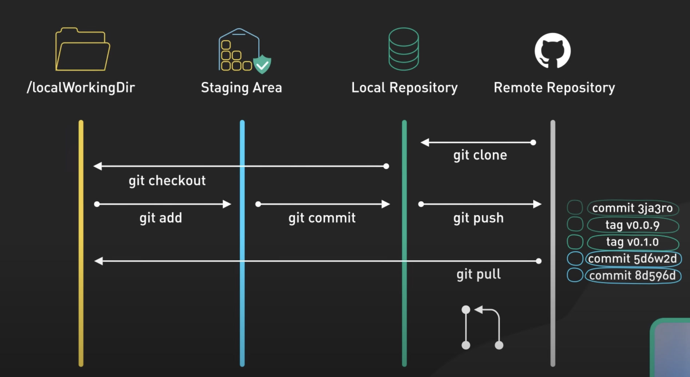

# Git

## What is git?
- Git is a distributed version control system (VCS) used to track changes in source code during software development. 
- It allows multiple developers to collaborate on a project by providing tools to manage different versions of code, merge changes from different branches, and roll back to previous versions if needed.
- Git is commonly used with platforms like GitHub, GitLab, and Bitbucket to host repositories and facilitate collaboration on open-source and private projects.
- Key features of Git include:
  - **Distributed:** Every developer has a complete copy of the repository, including its history. 
  - **Version Control:** Git tracks changes made to files, allowing you to revert to previous versions or compare changes over time. 
  - **Branching and Merging:** You can create branches to develop features independently and then merge them back into the main codebase. 
  - **Collaboration:** Git makes it easy for multiple developers to work on the same project by providing mechanisms to handle conflicts, synchronize changes, and review code.

## Data flow in git

## Git Commands

| Command                       | Usage                                                                                                            | Example                                                                                                                     |
|-------------------------------|------------------------------------------------------------------------------------------------------------------|-----------------------------------------------------------------------------------------------------------------------------|
| `git init`                    | Initializes a new Git repository in your project folder                                                          | `git init`                                                                                                                  |
| `git clone <repository_url>`  | Creates a local copy of a remote repository                                                                      | `git clone https://github.com/user/repo.git`                                                                                |
| `git add <file>`              | Stages changes (modified or new files) for the next commit                                                       | `git add filename.txt`,  to add all files - `git add .`                                                                     |
| `git commit -m "<message>" `  | Records staged changes to the repository with a descriptive message                                              | `git commit -m "Initial commit"`                                                                                            |
| `git status`                  | Shows the current state of the working directory and staging area (e.g., untracked, modified, or staged files)   | `git status`                                                                                                                |
| `git log`                     | Displays the commit history of the repository                                                                    | git log                                                                                                                     |
| `git diff`                    | Shows the differences between your working directory and the staging area (or between commits)                   | `git diff`                                                                                                                  |
| `git branch`                  | Lists all branches in the repository. The current branch is marked with an asterisk (*)                          | `git branch`                                                                                                                |
| `git checkout <branch>`       | Switches to another branch or commit                                                                             | `git checkout feature-branch` (for an existing branch), `git checkout -b new-branch` (to create and switch to a new branch) |
| `git merge <branch>`          | Merges the specified branch into the current branch                                                              | `git merge feature-branch`                                                                                                  |
| `git pull`                    | Fetches changes from the remote repository and merges them into the current                                      | `git pull origin main`                                                                                                      |
| `git push`                    | Pushes your committed changes to a remote repository                                                             | `git push origin main`                                                                                                      |
| `git reset --hard <commit>`   | Resets the working directory and staging area to match a specific commit (this is a destructive operation)       | `git reset --hard HEAD~1` (resets to the previous commit)                                                                   |
| `git stash`                   | Temporarily saves changes that aren’t ready to be committed so you can switch branches or work on something else | `git stash`, to reapply the stashed changes - `git stash pop`                                                               |
| `git rebase <branch>`         | Moves or combines a series of commits onto another base branch, maintaining a linear commit history              | `git rebase main`                                                                                                           |
| `git tag <tag_name>`          | Creates a tag for a specific commit, often used for marking releases                                             | `git tag v1.0`                                                                                                              |
| `git remote add <name> <url>` | Adds a remote repository (e.g., origin) with a specified URL                                                     | `git remote add origin https://github.com/user/repo.git`                                                                    |
| `git fetch`                   | Downloads objects and refs from another repository without merging them into the current branch                  | `git fetch origin`                                                                                                          |
| `git cherry-pick <commit>`    | Applies a specific commit from one branch into another                                                           | `git cherry-pick abc1234`                                                                                                   |
| `git rm <file>`               | Removes a file from the working directory and stages the removal for the next commit                             | `git rm filename.txt`                                                                                                       |
| `git fork`                    | Creates a copy of someone else's repository to your own GitHub account (this is done via GitHub UI)              |                                                                                                                             |
 

